# BulkCell-GNN

**COMP 7740 Neural Networks — The University of Memphis**

Bulk RNA-seq provides reliable patient-level MSI/MSS labels but masks cellular composition. Single-cell RNA-seq resolves cell-type structure but typically lacks the same breadth of clinical supervision. **BulkCell-GNN** bridges this gap by treating bulk and single-cell measurements as co-equal node sets in a **heterogeneous bipartite graph**, enabling bidirectional cross-modal message passing and **interpretable cell-type attention (γ)** over which populations drive each bulk sample’s prediction.

## Architecture

The model builds bulk–bulk, cell–cell, and bulk–cell edges, then fuses modalities with type-aware pooling and cross-attention. See also [`message_passing_three_flows.svg`](message_passing_three_flows.svg) for the three message-passing directions.

---

## Results

Full-cohort **Experiment 2** validation performance (same data split and hyperparameters across activations; see `04b_model_shilu.ipynb`):

| Activation | Val AUC |
|--------------|---------|
| ShiLU-SwishTanh | **0.9986** |
| ReLU | 0.9973 |
| GELU | 0.9952 |

---

## Novel activation: ShiLU-SwishTanh

$$
f(x; \alpha, \gamma, \delta) = \alpha \cdot \bigl[x \cdot \sigma\bigl(\gamma(x+\delta)\bigr)\bigr] + (1-\alpha) \cdot \tanh(x)
$$

A **learnable blend** of an adaptive, largely unbounded **ShiLU-style** term $x \cdot \sigma(\gamma(x+\delta))$ and a **bounded** $\tanh(x)$ branch, with **three learnable parameters per activation instance** $(\alpha, \gamma, \delta)$. The activation was **introduced in the COMP 7740 course assignment** and is **applied here inside a heterogeneous GNN** (replacing GELU in the main MLP blocks in [`bulkcell_gnn_shilu.py`](bulkcell_gnn_shilu.py)) for the first time in this project.

---

## Study tracks

| Track | Name | Single-cell scope | Notebooks | Focus |
|-------|------|-------------------|-----------|--------|
| **Experiment 1** | Prototype experiment | **Single patient** (SMC01, 5,226 tumor cells) | `01`–`06` | End-to-end pipeline before full-cohort scaling |
| **Experiment 2** | Full cohort experiment | **All tumor** cells (`-T_` barcodes) across patients | `01`, `02b`–`06b` (+ `03` for bulk symbols) | Larger graph, activation ablation (ShiLU vs GELU vs ReLU), extended figures |

Core model code: [`bulkcell_gnn.py`](bulkcell_gnn.py). The ShiLU variant used in Experiment 2 is in [`bulkcell_gnn_shilu.py`](bulkcell_gnn_shilu.py); keep the two modules aligned if you edit shared architecture.

---

## Where to run

- **Google Colab (recommended)** for Experiment 2: GPU helps training (`04` / `04b`); full single-cell preprocessing needs **RAM** and **disk** for the ~1.5 GB compressed count matrix and intermediate AnnData objects.
- **Local (Windows/macOS/Linux):** Works for Experiment 1; set `USE_DRIVE = False` and `DATA_DIR` to a folder under your project (e.g. `./data`). For Experiment 2 locally, ensure enough RAM for loading all tumor columns from the matrix.

**Data directory:** All notebooks write artifacts under a single `DATA_DIR` (default in prototype notebooks: `./data` next to the repo when `USE_DRIVE = False`). Extended notebooks (`02b`–`06b`) default to Colab Drive: `/content/drive/MyDrive/BulkCellGNN_data`. Use one consistent directory for an entire experiment so paths stay aligned. The **`data/`** folder is **gitignored** (large downloads and intermediates). Curated **figures and tables** intended for the repo live under **`results/`**, which **is** tracked—copy or symlink exports there before you push if you want them on GitHub.

### Google Colab — what to put where

1. **Open or upload the notebook(s)** you need (from this repo, or clone the repo and open `.ipynb` files from the file browser).
2. **GPU:** Runtime → Change runtime type → **GPU** for graph construction and training (`03`–`05`, `03b`–`05b`).
3. **Drive:** When a notebook uses `USE_DRIVE = True`, run the mount cell, then keep **`DATA_DIR`** the same as in that notebook (extended notebooks often use `MyDrive/BulkCellGNN_data`). For **`01`–`06`** on Colab, either set `USE_DRIVE = True` and the same `DATA_DIR` idea, or keep `False` and treat `/content` as the project root (see below).
4. **Experiment 1 (`01`–`06`):** Notebooks import **`bulkcell_gnn`** from the **session working directory** (`Path.cwd()`), i.e. the folder Colab considers the project root. Easiest: **`git clone`** this repository into `/content` (or upload **`bulkcell_gnn.py`** into the same directory as the notebook if you only upload a single `.ipynb`).
5. **Experiment 2 (`02b`–`06b`):** These add **`DATA_DIR`** to `sys.path` and expect **`bulkcell_gnn.py`** and **`bulkcell_gnn_shilu.py`** to live **in that same Drive folder** as your checkpoints and arrays (so imports resolve). **Upload or copy both `.py` files into `DATA_DIR`**, or clone the full repo **into** `DATA_DIR`, or add an extra `sys.path.insert(0, "/content/...")` pointing at your clone in the setup cell.

Dependencies: each notebook installs packages with `pip` in early cells; for PyTorch Geometric on Colab, follow the [PyG install](https://pytorch-geometric.readthedocs.io/en/latest/install/installation.html) notes in [`requirements.txt`](requirements.txt) so your **torch** and **torch-geometric** builds match.

---

## How to get data

### Bulk — GSE39582

- Handled in **`01_data_bulk.ipynb`** via **GEOparse** (downloads/caches series and MSI/MSS labels).
- No manual download required if GEO access works from your environment.

### Single-cell — GSE132465

- Primary file: **`GSE132465_GEO_processed_CRC_10X_raw_UMI_count_matrix.txt.gz`** (~1.5 GB compressed).
- **Direct URL:** [https://ftp.ncbi.nlm.nih.gov/geo/series/GSE132nnn/GSE132465/suppl/GSE132465_GEO_processed_CRC_10X_raw_UMI_count_matrix.txt.gz](https://ftp.ncbi.nlm.nih.gov/geo/series/GSE132nnn/GSE132465/suppl/GSE132465_GEO_processed_CRC_10X_raw_UMI_count_matrix.txt.gz)
- **`02_data_singlecell.ipynb`** downloads this file into `DATA_DIR` on first run (if missing).
- **`02b_data_singlecell_full.ipynb`** does not download the matrix; run **`02` once** first, or place the `.gz` file in `DATA_DIR` yourself with the exact filename above.

### Gene ID mapping (bulk)

- GSE39582 uses **Affymetrix probe IDs**; single-cell data uses **HGNC symbols**. Notebook **`03_graph_construction.ipynb`** maps probes → symbols with **GPL570** (via GEOparse) and writes **`bulk_expr_sym.npy`** / **`bulk_genes_sym.npy`**. Experiment 2 **`03b`** expects these files to already exist.

---

## Environment and dependencies

Install packages **inside the notebooks** (each has `pip install` cells), or mirror the lists below in a local venv.

**Experiment 1 — typical sets**

- **01–02:** `GEOparse`, `pandas`, `numpy`, `scanpy`, `anndata`, `scipy`, `matplotlib`, `scikit-learn`, `leidenalg`, `python-igraph`
- **03–05:** `torch`, `torch-geometric` (on Colab, use CUDA-matched PyG wheels when possible; see [PyG install](https://pytorch-geometric.readthedocs.io/en/latest/install/installation.html)); notebook `03` includes a fallback `pip install torch_geometric`
- **05:** `umap-learn`
- **05b:** also `seaborn`

**Experiment 2 — `02b`–`06b`**

- Same stack as above; **`04b`** imports both **`bulkcell_gnn`** and **`bulkcell_gnn_shilu`**.

*(Colab upload layout for the two Python modules is summarized in **Google Colab — what to put where** above.)*

---

## Experiment 1 — prototype (SMC01)

**Goal:** Full pipeline on **one patient** (SMC01 tumor barcodes only) through publication-style figures, before scaling to all tumor cells in Experiment 2.

**Run order**

1. **`01_data_bulk.ipynb`** — GSE39582, labels, **z-score normalize per gene** (across bulk samples; microarray-safe) → `bulk_*.npy`
2. **`02_data_singlecell.ipynb`** — matrix download, subset to **SMC01** `-T_` columns, QC, HVGs, Leiden + markers → `cell_*.npy`, `cell_type_names.json`
3. **`03_graph_construction.ipynb`** — probe→symbol, intersect genes, B–B / C–C / B–C graphs → `edge_*.pt`, `bulk_expr_sym.npy`, `bulk_genes_sym.npy`, `bulk_shared.npy`, `cell_shared.npy`, `graph_meta.json`
4. **`04_model.ipynb`** — train `BulkCellGNN` → `model_best.pt`, `hB_final.pt`, `hC_final.pt`, masks
5. **`05_evaluation.ipynb`** — ROC, γ heatmap, UMAPs, `auc_score.txt`
6. **`06_report_figures.ipynb`** — 300 DPI exports → `data/figures/` (or `DATA_DIR/figures/`)

**Reproducibility:** Use **`SEED = 42`** everywhere as in the notebooks. GPU determinism is best-effort.

---

## Experiment 2 — full cohort

**Goal:** All **tumor** single cells, larger graphs, **three-way activation ablation** (ShiLU-SwishTanh vs GELU vs ReLU), extended evaluation and figure exports.

**Why `01` and `03` appear in this track:** `03b` needs **`bulk_expr_sym.npy`** and **`bulk_genes_sym.npy`**, which are produced in **`03_graph_construction.ipynb`** (after **`01`** and **`02`** outputs exist). The smallest reliable path is to run the **prototype `02` + `03`** at least through the cells that **save** `bulk_expr_sym.npy` / `bulk_genes_sym.npy` (running all of **`03`** is fine and also builds the prototype graphs, which use different filenames from the `_full` graph).

**Recommended run order**

1. **`01_data_bulk.ipynb`**
2. **`02_data_singlecell.ipynb`** — ensures the GEO matrix is on disk and provides the inputs **`03`** expects for loading cell arrays (even if you will replace cells with **`02b`** later)
3. **`03_graph_construction.ipynb`** — must complete through saving **`bulk_expr_sym.npy`** and **`bulk_genes_sym.npy`** (full notebook run is simplest)
4. **`02b_data_singlecell_full.ipynb`** — all tumor cells, QC, HVGs, Leiden + markers → `cell_*_full.npy`, `cell_type_names_full.json`, etc.
5. **`03b_graph_construction_full.ipynb`** — graphs on full cohort → `edge_*_full.pt`, `bulk_shared_full.npy`, `cell_shared_full.npy`, `graph_meta_full.json`, `edge_BC_full_weights.pt`
6. **`04b_model_shilu.ipynb`** — trains ShiLU, GELU, ReLU variants → e.g. `model_best_shilu.pt`, `model_best_gelu.pt`, `model_best_relu.pt`, matching `hB_*`, `hC_*`, `gamma_*.npy`, `training_logs_ablation.json`, `model_timing_summary.csv`, `ablation_val_auc_overlay.png`
7. **`05b_evaluation_comparison.ipynb`** — comparative metrics and interpretability outputs
8. **`06b_report_figures_extended.ipynb`** — 300 DPI set under **`DATA_DIR/figures_extended/`**

**Hardware note:** `03b` C–C and B–C steps scale with cell count; allow substantial runtime and memory on full tumor data.

---

## Outputs (reference)

### Experiment 1 (selected)

| Artifact | Produced in |
|----------|-------------|
| `bulk_expr.npy`, `bulk_genes.npy`, `bulk_labels.npy`, `bulk_sample_ids.npy` | 01 |
| `cell_expr.npy`, `cell_genes.npy`, `cell_types.npy`, `cell_umap.npy`, `cell_type_names.json` | 02 |
| `edge_BB.pt`, `edge_CC.pt`, `edge_BC.pt`, `edge_BC_weights.pt`, `bulk_shared.npy`, `cell_shared.npy`, `bulk_expr_sym.npy`, `bulk_genes_sym.npy`, `graph_meta.json` | 03 |
| `model_best.pt`, `hB_final.pt`, `hC_final.pt`, `train_mask.npy`, `val_mask.npy` | 04 |
| `roc_curve.png`, `gamma_heatmap.png`, `cell_umap_emb.png`, `bulk_umap_emb.png`, `auc_score.txt` | 05 |
| `figures/*_300dpi.png` | 06 |

### Experiment 2 (selected)

| Artifact | Produced in |
|----------|-------------|
| `cell_expr_full.npy`, `cell_genes_full.npy`, `cell_types_full.npy`, `cell_umap_full.npy`, `cell_type_names_full.json`, `cell_patient_ids_full.npy`, `umap_by_patient_full.png` | 02b |
| `edge_BB_full.pt`, `edge_CC_full.pt`, `edge_BC_full.pt`, `edge_BC_full_weights.pt`, `bulk_shared_full.npy`, `cell_shared_full.npy`, `graph_meta_full.json` | 03b |
| `model_best_{shilu,gelu,relu}.pt`, `hB_*.pt`, `hC_*.pt`, `gamma_*.npy`, `train_mask_full.npy`, `val_mask_full.npy`, `training_logs_ablation.json`, `model_timing_summary.csv` | 04b |
| Extended analysis outputs | 05b |
| `figures_extended/` | 06b |

---

## Datasets

- **[GSE39582](https://www.ncbi.nlm.nih.gov/geo/query/acc.cgi?acc=GSE39582)** — bulk CRC expression (*Marisa et al., PLoS Med. 2013*).
- **[GSE132465](https://www.ncbi.nlm.nih.gov/geo/query/acc.cgi?acc=GSE132465)** — scRNA-seq of primary CRC and matched normal (*Lee et al., Nat. Genet. 2020*).
